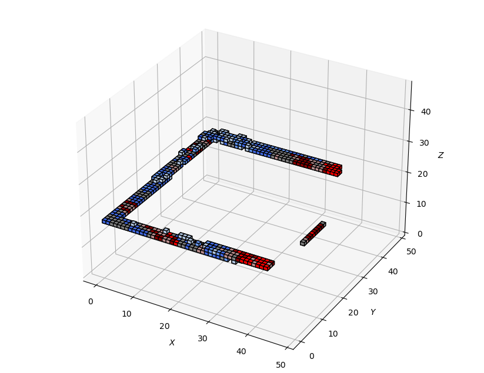
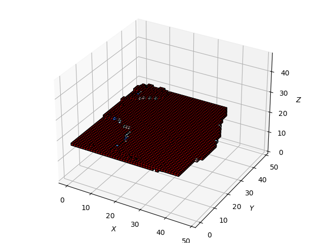
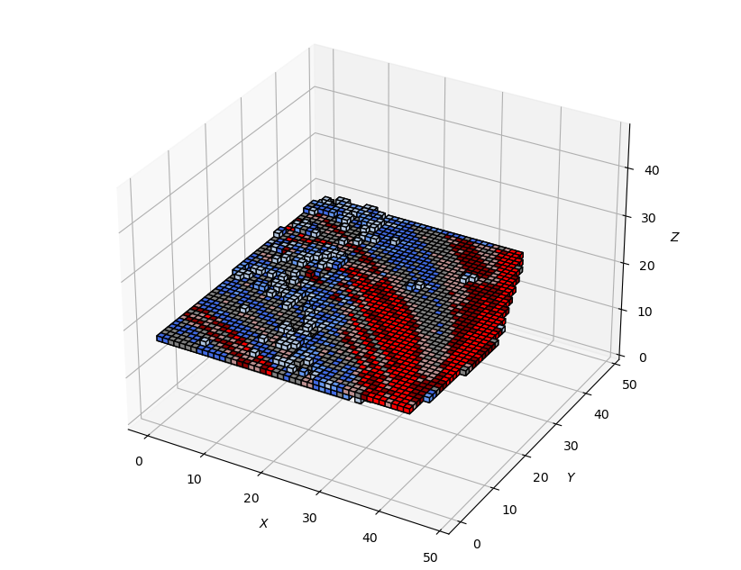
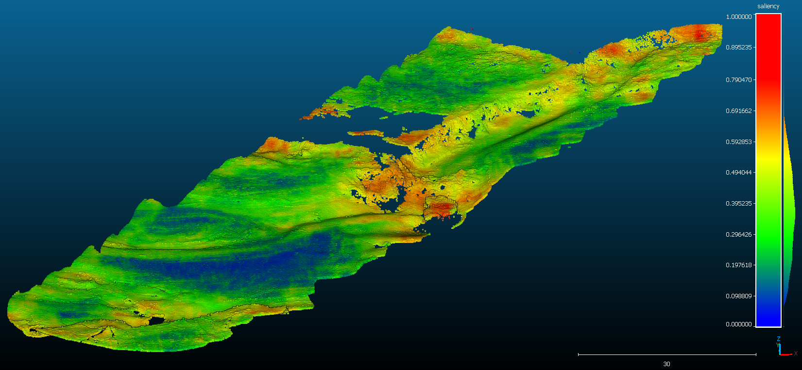

# 3D Saliency by Anomaly
Looking for salient features by learning anomalies. 

A 3D CNN is trained for "inpainting/reconstructing" a voxel grid based on the "shell" of the grid.
The reconstruction error is interpreted as saliency.

#### Example for the reconstruction task solved by a CNN:

|Shell | Reconstruction | Reference|
|---|---|---|
||||

#### Visualization of the predicted saliency:

## Requirements
For preprocessing the files (classification to vegetation and terrain) the following packages are required:

    - OPALS v.2.5.0
    - open3d v.0.16.0

## Trained model
Available [here](https://huggingface.co/wittich/3d-unet_16x48x48x48/tree/main) (hosted at huggingface.co).

## Usage
- Install conda environment: `conda env create -f environment.yml`
- Activate environment: `conda activate saly`
- Run training: `python training.py ./runs/training_small.yaml`
- Run inference: `python training.py ./runs/inference.yaml`

## Publication

(in progress)

## Credits:

- Reuma Arav
- Dennis Wittich
